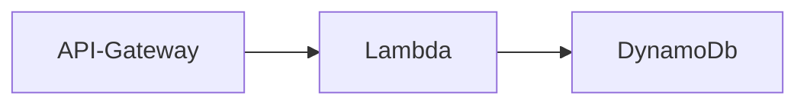

# Robobarista

## Simple serverless app deployed with AWS SAM

This SAM application show a simple serverless coffee ordering app.
It should NOT be used in a production environment as it exposes an HTTP API endpoint from AWS API Gateway

Pre-requisites:
- Git client (https://github.com/git-guides/install-git)
- AWS CLI (https://docs.aws.amazon.com/cli/latest/userguide/getting-started-install.html)
- AWS SAM (https://docs.aws.amazon.com/serverless-application-model/latest/developerguide/install-sam-cli.html)

Recommendation:
- Python 3.9

## Installing the coffee app

In your local dev folder clone the repository.
This will create a new folder call robobarista.

    git clone https://github.com/sosueme99/robobarista.git

    cd robobarista

    aws deploy --guide

The first time you run sam deploy --guide it will prompt for a few requirements.
You can save your choices in samconfig.toml file. 

Stack Name [sam-app]: <mark style="background-color: #FFFF00">toms-demo-app</mark>
AWS Region [eu-west-2]: 
#Shows you resources changes to be deployed and require a 'Y' to initiate deploy
Confirm changes before deploy [y/N]: y
#SAM needs permission to be able to create roles to connect to the resources in your template
Allow SAM CLI IAM role creation [Y/n]: y
#Preserves the state of previously provisioned resources when an operation fails
Disable rollback [y/N]: n
LambdaFunction may not have authorization defined, Is this okay? [y/N]: y
Save arguments to configuration file [Y/n]: y
SAM configuration file [samconfig.toml]: 
SAM configuration environment [default]:

