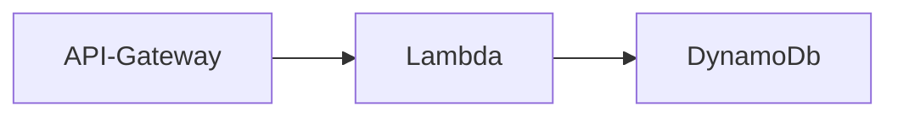

# Robobarista

## Simple serverless app deployed with AWS SAM

This SAM application show a simple serverless coffee ordering app.
It should NOT be used in a production environment as it exposes an HTTP API endpoint from AWS API Gateway

Pre-requisites:
- Git client (https://github.com/git-guides/install-git)
- AWS CLI (https://docs.aws.amazon.com/cli/latest/userguide/getting-started-install.html)
- AWS SAM (https://docs.aws.amazon.com/serverless-application-model/latest/developerguide/install-sam-cli.html)

Recommendation:
- Python 3.9

## Installing the coffee app

    mkdir robobarista
    cd robobarista
    git clone https://github.com/sosueme99/robobarista.git

