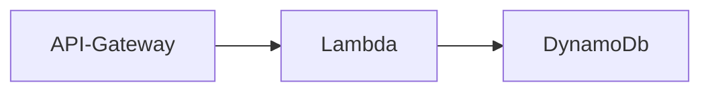

# Robobarista

## Simple serverless coffee app deployed with AWS SAM

This SAM application show a simple serverless coffee ordering app.
It should NOT be used in a production environment as it exposes an HTTP API endpoint from AWS API Gateway

Pre-requisites:
- Git client (https://github.com/git-guides/install-git)
- AWS CLI (https://docs.aws.amazon.com/cli/latest/userguide/getting-started-install.html)
- AWS SAM (https://docs.aws.amazon.com/serverless-application-model/latest/developerguide/install-sam-cli.html)

## Installing the coffee app

The stackset will create an API Gateway HTTP Api endpoint with the same name as the stack you create.

It will also create a Lambda function and a DynamoDb table both called **robobarista**

The final output from the stack is the API URL that you can then demo.

Key             EndpointUrl

Description     HTTP API endpoint URL

Value           **https://xxxxxxxxxxxx.execute-api.eu-west-2.amazonaws.com/**

In your local dev folder clone the repository.
This will create a new folder called robobarista.

    git clone https://github.com/sosueme99/robobarista.git

    cd robobarista

    sam deploy --guided

The first time you run **sam deploy --guided** it will prompt for a few requirements.

You can save your choices in **samconfig.toml** file. 

You must specify Stack Name: **The API Gateway inherits this name.**

Choose your region. Currently defaults to eu-west-2 London.

You will need to allow the SAM CLI IAM Role creation.

As this is just for short term demo we will not use an authoriser. Read more here about authorisers and access control. https://docs.aws.amazon.com/apigateway/latest/developerguide/http-api.html 

Example output:

    Stack Name [sam-app]: your_app_name 
    AWS Region [eu-west-2]: 
    Confirm changes before deploy [y/N]: y
    Allow SAM CLI IAM role creation [Y/n]: y
    Disable rollback [y/N]: n
    LambdaFunction may not have authorization defined, Is this okay? [y/N]: y
    Save arguments to configuration file [Y/n]: y

## Updating the existing deployment
If you update the lambda or the SAM templates you can update the running application.

Run the following commands from the application folder

    sam build
    sam deploy

## Deleting the application
If you want to delete the application from your AWS account.

Run the following commands from the application folder

    sam delete

